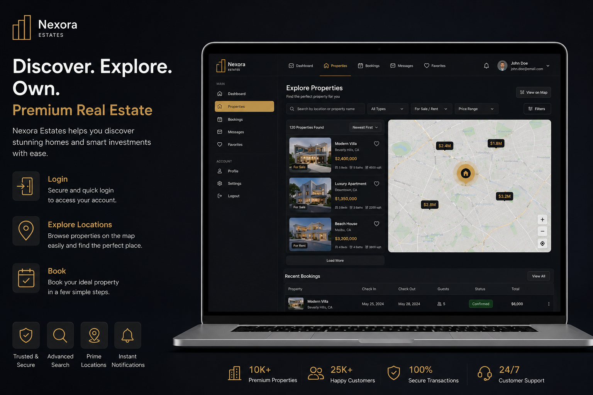
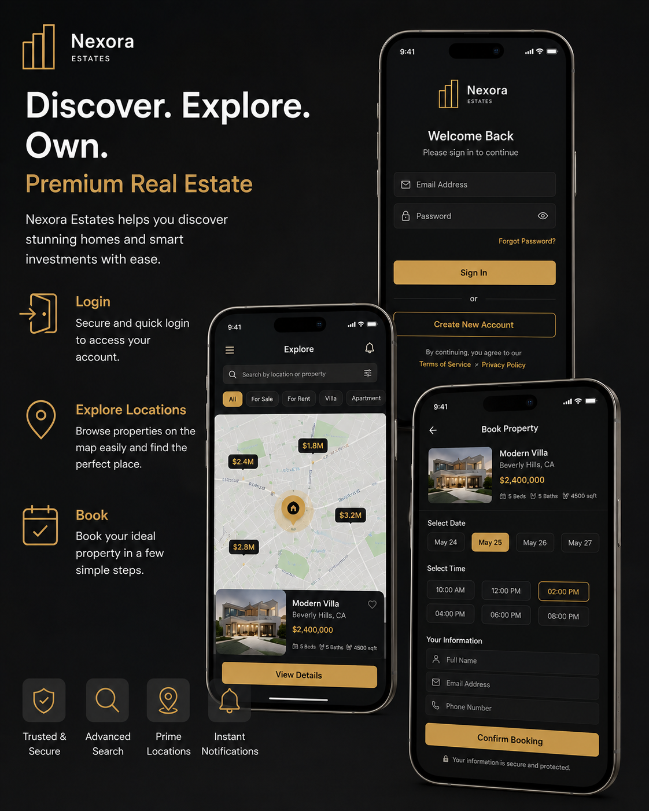

# 🏙️ Nexora Estates — Modern Real Estate Platform

<div align="center">

# 🏡 Nexora Estates

### Premium Modern Real Estate Platform Built With React & Vite


<br/>

✨ Luxury Property Experience  
⚡ High Performance Frontend  
📱 Fully Responsive Design  
🔐 Secure Authentication System  

<br/>

<a href="https://nexora-estates-24.jawasakher.workers.dev/" target="_blank">
  
</a>

</div>

---

# 🌍 Live Preview

🚀 **Demo:**  
https://nexora-estates-24.jawasakher.workers.dev/

---

# 📸 Project Preview

## 🖥️ Desktop View



## 📱 Mobile View



---

# ✨ Features

## 🏠 Property Management

- Modern property listings
- Advanced property details page
- Dynamic image gallery
- Property inquiry system
- Owner dashboard
- Add / Edit / Manage properties

## 🔐 Authentication

- Secure login & signup
- Clerk authentication integration
- Protected routes
- User session management

## 📱 Responsive UI

- Mobile-first design
- Tablet optimized layout
- Smooth animations
- Clean modern interface

## ⚡ Performance

- Vite ultra-fast build system
- Optimized image loading
- Lazy loading support
- Clean architecture

## 🎨 UI/UX

- Luxury real estate aesthetic
- Interactive property cards
- Elegant typography
- Smooth user experience

---

# 🛠️ Tech Stack

| Technology | Usage |
|------------|-------|
| React | Frontend Framework |
| Vite | Build Tool |
| Tailwind CSS | Styling |
| Clerk | Authentication |
| React Router | Navigation |
| Context API | State Management |

---

# 📂 Project Structure

```bash
src/
│
├── components/
├── pages/
├── context/
├── assets/
├── services/
├── layouts/
└── utils/
```

---

# 🚀 Getting Started

## 1️⃣ Clone Repository

```bash
git clone https://github.com/your-username/nexora-estates.git
```

## 2️⃣ Install Dependencies

```bash
npm install
```

## 3️⃣ Setup Environment Variables

Create `.env` file:

```env
VITE_CLERK_PUBLISHABLE_KEY=your_key
VITE_API_URL=your_api
VITE_CURRENCY=$
```

---

# ▶️ Run Development Server

```bash
npm run dev
```

---

# 🏗️ Build For Production

```bash
npm run build
```

---

# 🔥 Key Highlights

✅ Modern Real Estate UI  
✅ Clean Scalable Architecture  
✅ Responsive On All Devices  
✅ Authentication & Dashboard  
✅ Optimized Performance  
✅ SEO Friendly Structure  

---

# 📈 Future Improvements

- AI Property Recommendations
- Real-time Chat System
- Advanced Filters
- Interactive Maps
- Mortgage Calculator
- Multi-language Support

---

# 🤝 Contributing

Contributions are welcome!

1. Fork the repository
2. Create your feature branch
3. Commit your changes
4. Push to the branch
5. Open a Pull Request

---

# 📄 License

This project is licensed under the MIT License.

---

<div align="center">

### ⭐ If You Like This Project, Give It A Star ⭐


</div>

