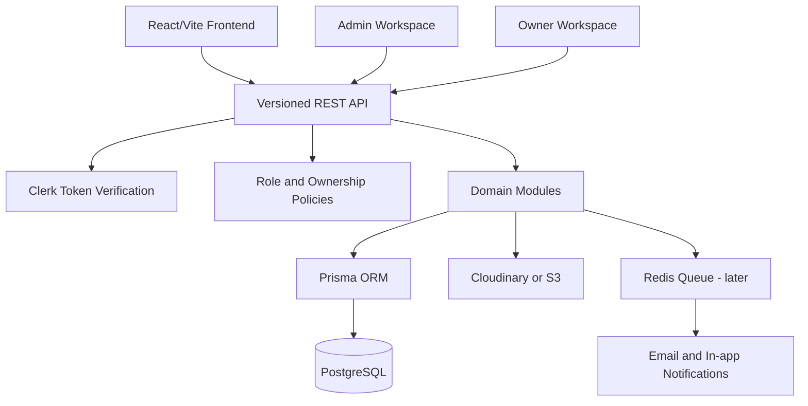
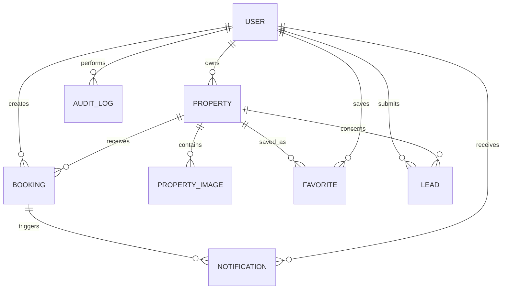
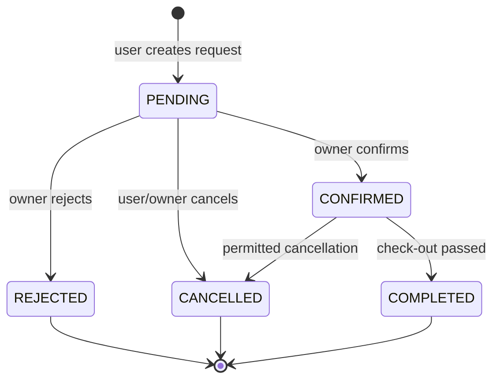

# Nexora Estates Backend Architecture

Status: Architecture baseline, before backend implementation
Date: 2026-09-22

## 1. Target

Nexora Estates will evolve from a React/Vite frontend with optional APIs into a production-ready real-estate platform with:

- server-side authentication and authorization
- PostgreSQL as the source of truth
- Prisma as the data-access layer
- property CRUD and media management
- availability-aware bookings
- owner and admin workspaces
- leads, audit logs, and notifications
- versioned REST APIs that preserve the current frontend contracts

The first backend release is intentionally a modular monolith. It keeps deployment and operations simple while preserving boundaries that can later be extracted into services.

## 2. Proposed repository boundary

```text
Nexora-Estates/
├── src/                         # existing React frontend
├── server/                      # new backend application
│   ├── src/
│   │   ├── config/
│   │   ├── middleware/
│   │   ├── modules/
│   │   │   ├── auth/
│   │   │   ├── users/
│   │   │   ├── properties/
│   │   │   ├── bookings/
│   │   │   ├── leads/
│   │   │   ├── notifications/
│   │   │   ├── media/
│   │   │   ├── analytics/
│   │   │   └── admin/
│   │   ├── shared/
│   │   │   ├── errors/
│   │   │   ├── pagination/
│   │   │   └── validation/
│   │   ├── app.ts
│   │   └── server.ts
│   ├── prisma/
│   │   ├── schema.prisma
│   │   └── seed.ts
│   └── tests/
├── docs/
└── package.json
```

Implementation can start in a separate `server/` package or a workspace package. The frontend remains deployable independently during migration.

## 3. Runtime architecture



### Architectural decisions

1. Use a modular monolith for v1.
2. Use REST under `/api/v1` because the current frontend already has endpoint-oriented services.
3. Verify Clerk JWTs on every protected backend request.
4. Store application roles and ownership relations in PostgreSQL; Clerk remains the identity provider.
5. Enforce authorization in backend policies, never in React routes alone.
6. Use cursor pagination for large lists and conventional page metadata for the first release.
7. Store media metadata in PostgreSQL and binary files in Cloudinary/S3.
8. Use database transactions for booking creation, approval, cancellation, and property deletion.

## 4. Roles and authorization

### Roles

- `USER`: browse properties, manage own favorites and bookings, submit leads
- `OWNER`: manage only owned properties and their booking requests
- `AGENT`: optional later role for assigned leads and properties
- `ADMIN`: manage the whole platform, moderation, reports, and audit logs

### Request authorization flow

```text
Request
  -> extract Bearer token
  -> verify Clerk JWT signature and issuer
  -> upsert local User by clerkUserId
  -> resolve role from local database and verified Clerk claims
  -> run route policy
  -> run ownership policy where required
  -> execute service transaction
```

The backend must reject forged client-supplied `ownerId`, `userId`, role, or payment state. These values come from the verified request context or trusted server integrations.

## 5. PostgreSQL domain model



### Core tables

#### User

- `id` UUID primary key
- `clerkUserId` unique, required
- `email` unique, required
- `name`
- `avatarUrl`
- `role` enum: `USER`, `OWNER`, `AGENT`, `ADMIN`
- `status` enum: `ACTIVE`, `SUSPENDED`, `DELETED`
- `createdAt`, `updatedAt`

#### Property

- `id` UUID primary key
- `ownerId` foreign key to User
- `title`, `slug`, `description`
- `propertyType` enum or controlled string
- `status`: `DRAFT`, `PENDING_REVIEW`, `PUBLISHED`, `HIDDEN`, `ARCHIVED`
- `listingType`: `SALE`, `RENT`, `BOTH`
- `priceSale`, `priceRent`, `currency`
- `area`, `bedrooms`, `bathrooms`, `garages`
- `city`, `country`, `address`
- `latitude`, `longitude`
- `isAvailable`
- `publishedAt`, `createdAt`, `updatedAt`

Indexes: `status`, `ownerId`, `city`, `country`, `propertyType`, `priceRent`, `priceSale`, and a search index over title/description/location.

#### PropertyImage

- `id` UUID primary key
- `propertyId` foreign key
- `url`, `storageKey`, `altText`
- `sortOrder`
- `isCover`
- `createdAt`

#### Booking

- `id` UUID primary key
- `userId` foreign key
- `propertyId` foreign key
- `checkInDate`, `checkOutDate`
- `guests`
- `totalPrice`, `currency`
- `status`: `PENDING`, `CONFIRMED`, `REJECTED`, `CANCELLED`, `COMPLETED`
- `paymentStatus`: `UNPAID`, `PENDING`, `PAID`, `REFUNDED`
- `customerNote`, `ownerNote`, `rejectionReason`
- `createdAt`, `updatedAt`

Booking rules:

- check-in must be before check-out
- guests must be positive and within property capacity when configured
- a confirmed or pending booking cannot overlap another active booking
- owner approval and cancellation are transactional
- clients cannot set `status`, `paymentStatus`, `userId`, or `totalPrice` directly

#### Lead

- `id` UUID primary key
- `userId` nullable foreign key
- `propertyId` nullable foreign key
- `assignedToId` nullable foreign key
- `name`, `email`, `phone`, `message`
- `source`: `CONTACT`, `PROPERTY_INQUIRY`, `NEWSLETTER`, `AI_ASSISTANT`, `OTHER`
- `status`: `NEW`, `CONTACTED`, `QUALIFIED`, `CONVERTED`, `LOST`
- `createdAt`, `updatedAt`

#### Favorite

- `userId`, `propertyId` composite primary key
- `createdAt`

#### Notification

- `id` UUID primary key
- `userId` foreign key
- `type`, `title`, `body`
- `readAt`
- `metadata` JSONB
- `createdAt`

#### AuditLog

- `id` UUID primary key
- `actorId` nullable foreign key
- `action`, `entityType`, `entityId`
- `before` JSONB nullable
- `after` JSONB nullable
- `ipAddress`, `userAgent`
- `createdAt`

## 6. REST API contract

Base URL: `/api/v1`

### Health and identity

| Method | Endpoint | Access | Purpose |
|---|---|---|---|
| GET | `/health` | Public | Liveness/readiness check |
| GET | `/me` | Authenticated | Return local user profile and role |
| PATCH | `/me` | Authenticated | Update editable profile fields |

### Public properties

| Method | Endpoint | Access | Purpose |
|---|---|---|---|
| GET | `/properties` | Public | Paginated search and filters |
| GET | `/properties/:idOrSlug` | Public | Property details |
| GET | `/properties/:id/availability` | Public | Available booking dates |
| POST | `/properties/:id/inquiry` | Public/Auth | Create property lead |

Supported query parameters for `GET /properties`:

```text
page, limit, cursor, q, city, country, propertyType,
listingType, minPrice, maxPrice, bedrooms, bathrooms,
sort, status=published
```

Response shape:

```json
{
  "data": [],
  "meta": {
    "page": 1,
    "limit": 20,
    "total": 0,
    "hasNextPage": false
  }
}
```

### Owner properties

| Method | Endpoint | Access | Purpose |
|---|---|---|---|
| GET | `/owner/properties` | Owner/Admin | List properties owned by current owner |
| POST | `/owner/properties` | Owner/Admin | Create property and media metadata |
| GET | `/owner/properties/:id` | Owner/Admin | Read owned property |
| PUT | `/owner/properties/:id` | Owner/Admin | Update owned property |
| DELETE | `/owner/properties/:id` | Owner/Admin | Archive property |
| PATCH | `/owner/properties/:id/availability` | Owner/Admin | Toggle availability |
| POST | `/owner/properties/:id/submit-review` | Owner | Submit draft for moderation |

The existing frontend endpoint names can continue to work through this contract.

### Media

| Method | Endpoint | Access | Purpose |
|---|---|---|---|
| POST | `/media/presign` | Owner/Admin | Create signed upload target |
| POST | `/properties/:id/images` | Owner/Admin | Attach uploaded media |
| PATCH | `/properties/:id/images/reorder` | Owner/Admin | Reorder images |
| DELETE | `/properties/:id/images/:imageId` | Owner/Admin | Remove media |

### Bookings

| Method | Endpoint | Access | Purpose |
|---|---|---|---|
| GET | `/bookings/me` | Authenticated | List current user's bookings |
| POST | `/bookings` | Authenticated | Create booking request |
| GET | `/bookings/:id` | Owner/User/Admin | Read permitted booking |
| POST | `/bookings/:id/cancel` | User/Owner/Admin | Cancel booking |
| GET | `/owner/bookings` | Owner/Admin | List owner booking requests |
| POST | `/owner/bookings/:id/confirm` | Owner/Admin | Confirm booking |
| POST | `/owner/bookings/:id/reject` | Owner/Admin | Reject booking |
| GET | `/admin/bookings` | Admin | Search all bookings |

Create booking request:

```json
{
  "propertyId": "uuid",
  "checkInDate": "2026-10-01",
  "checkOutDate": "2026-10-05",
  "guests": 2,
  "customerNote": "Optional note"
}
```

The server calculates price and validates overlap inside a transaction.

### Leads, newsletter, and analytics

| Method | Endpoint | Access | Purpose |
|---|---|---|---|
| POST | `/leads` | Public/Auth | Create contact or property inquiry |
| GET | `/owner/leads` | Owner/Admin | List permitted leads |
| PATCH | `/owner/leads/:id` | Owner/Admin | Update lead status/assignment |
| POST | `/newsletter/subscriptions` | Public | Subscribe email |
| POST | `/analytics/events` | Public/Auth | Record non-sensitive product event |

### Admin

| Method | Endpoint | Access | Purpose |
|---|---|---|---|
| GET | `/admin/users` | Admin | Search and filter users |
| PATCH | `/admin/users/:id/role` | Admin | Change application role |
| GET | `/admin/properties` | Admin | Moderation queue and all properties |
| POST | `/admin/properties/:id/publish` | Admin | Publish property |
| POST | `/admin/properties/:id/reject` | Admin | Reject property with reason |
| GET | `/admin/reports/overview` | Admin | Dashboard metrics |
| GET | `/admin/audit-logs` | Admin | Search audit trail |

## 7. Error and validation contract

All API errors use one shape:

```json
{
  "error": {
    "code": "PROPERTY_NOT_FOUND",
    "message": "Property was not found.",
    "details": {}
  },
  "requestId": "req_123"
}
```

Initial error codes:

- `VALIDATION_ERROR`
- `UNAUTHENTICATED`
- `FORBIDDEN`
- `NOT_FOUND`
- `PROPERTY_NOT_FOUND`
- `BOOKING_DATE_CONFLICT`
- `BOOKING_INVALID_RANGE`
- `BOOKING_NOT_CANCELLABLE`
- `UPLOAD_FAILED`
- `RATE_LIMITED`
- `INTERNAL_ERROR`

Use Zod or equivalent request schemas at the HTTP boundary. Never trust frontend validation as a security control.

## 8. Booking state machine



Every transition must check the actor role, current state, cancellation policy, and relevant dates. Each successful transition writes an audit log and schedules a notification.

## 9. Security baseline

- Verify Clerk JWT issuer, audience, signature, and expiration.
- Do not accept role, owner ID, or payment status from the browser.
- Validate and sanitize all request bodies and query parameters.
- Apply rate limits to auth-adjacent, lead, booking, and analytics endpoints.
- Restrict CORS to configured frontend origins.
- Use secure headers and structured request IDs.
- Redact tokens and personal data from logs.
- Validate upload MIME type, size, and image dimensions.
- Use soft delete/archive for business entities where history matters.
- Add audit logs for roles, properties, bookings, and admin actions.

## 10. Delivery order

### Slice 1: foundation

- create `server/` package
- Express/Nest bootstrap
- environment validation
- Prisma and PostgreSQL connection
- health endpoint
- error handler and request IDs
- Clerk token middleware

### Slice 2: identity and properties

- User upsert from Clerk
- role policy middleware
- Property and PropertyImage models
- public property list/detail
- owner CRUD
- pagination and validation
- frontend service switch from mock fallback to API

### Slice 3: media and moderation

- signed media uploads
- image ordering/deletion
- draft and review statuses
- admin property moderation
- audit logs

### Slice 4: bookings

- Booking model and migrations
- availability query
- transactional booking creation
- owner confirm/reject
- cancellation rules
- user and owner booking views

### Slice 5: operational features

- leads and contact messages
- newsletter subscriptions
- notifications
- admin overview reports
- API documentation
- integration tests and seed data

## 11. Definition of done for phase 1

Phase 1 is complete only when:

- a clean database can be created from migrations
- Clerk-authenticated requests resolve to a local User
- public properties come from PostgreSQL
- owner CRUD is server-authorized by ownership
- uploaded images are stored outside PostgreSQL with metadata persisted
- bookings reject overlapping active reservations transactionally
- admin can moderate properties and inspect audit logs
- frontend mock fallback is disabled in production configuration
- OpenAPI documentation and seed/demo data are included
- automated tests cover auth, ownership, property CRUD, and booking conflicts
